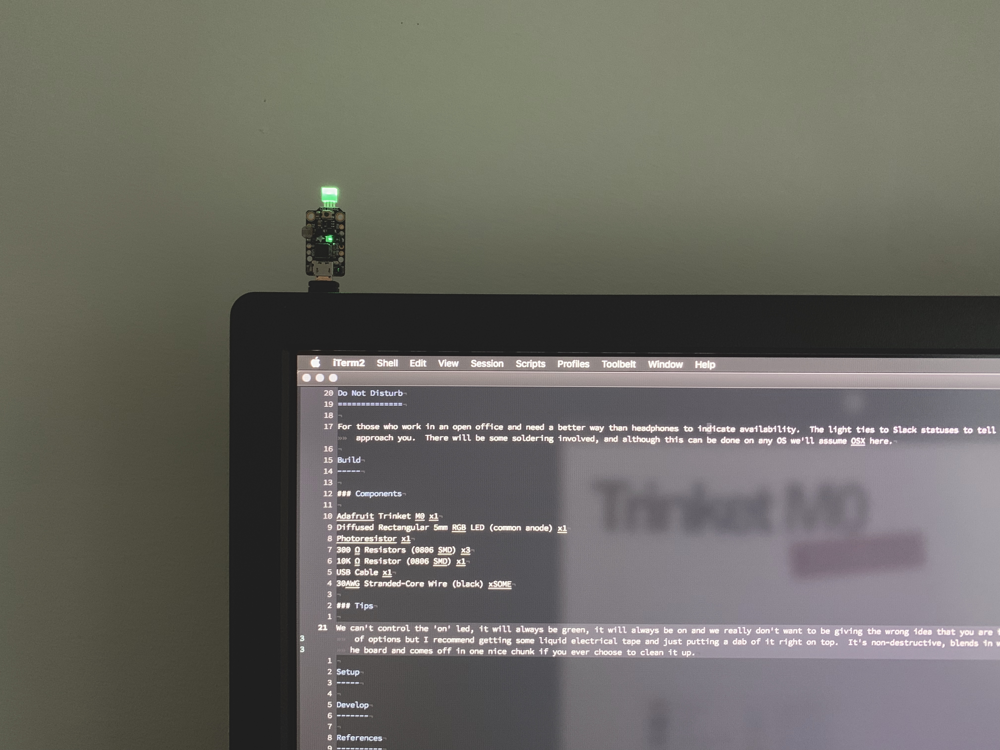
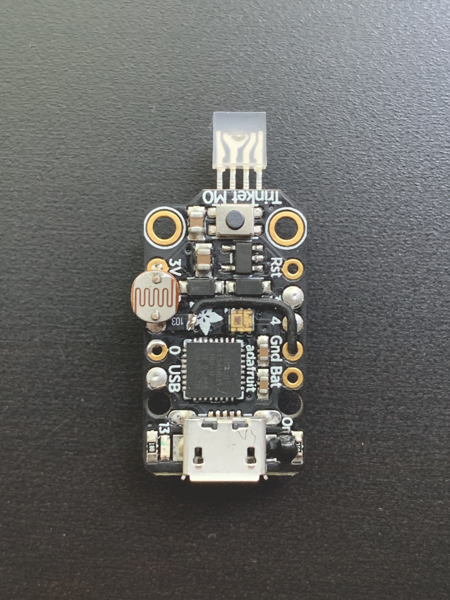
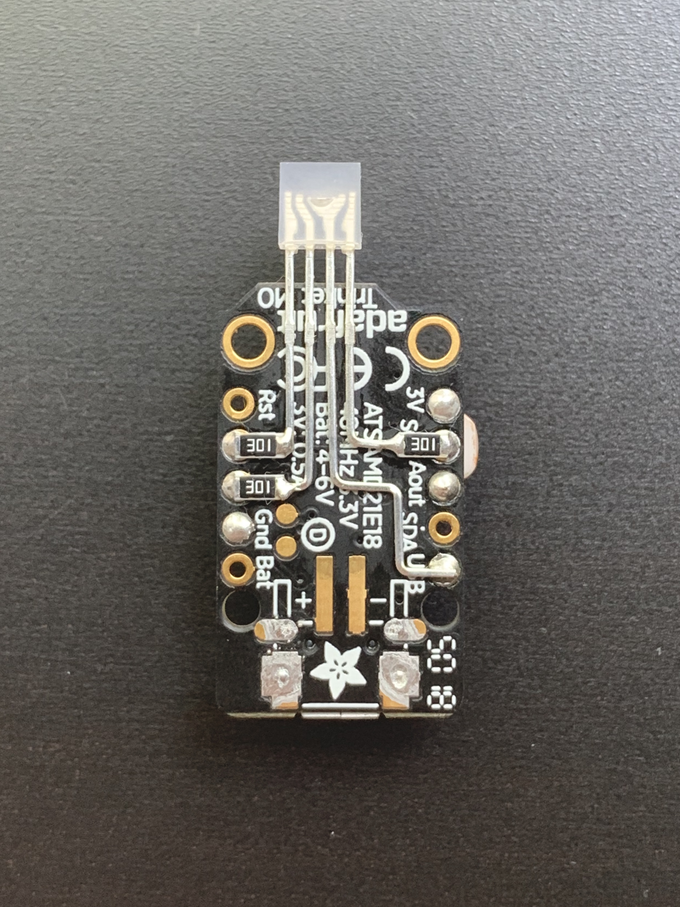

Do Not Disturb
==============

A hardware and software project for those who work in an open office and need a better way than headphones to indicate availability.  The light ties to Slack statuses to tell others how wary they should be to approach you.  There will be some soldering involved, and although this can be done on any OS we'll assume OSX here.

| Light Color | Light Behavior | Slack Status Text | Slack Status Emoji | Other |
| :---------- | :------------- | :---------------- | :----------------- | :---- |
| blue    | solid   | - | - | server has not connected to trinket |
| red     | solid   | 'focused', 'busy' | - | |
| red     | solid   | - | :triangular_flag_on_post:, :red_circle:, :woman-gesturing-no:, :man-gesturing-no:, :male-technologist:, :female-technologist: | |
| red     | pulsing | 'in a meeting', 'on a call' | - | |
| red     | pulsing | - | :middle_finger: | |
| green   | solid   | __default__ | __default__ | If there is no status or one we don't trigger on the light will default green. |
| green   | pulsing | - | - | - |
| yellow  | solid   | 'thinking' | - | |
| yellow  | solid   | - | :thinking_face:, :sleeping:, :shushing_face: | |
| yellow  | pulsing | - | - | - |

* If there is Status Text then we ignore the Status Emoji, only if there is no Status Text do we set the light based on Status Emoji.

Build
-----

| Trinket M0 Front | Trinket M0 Back |
| :-----------: | :----------: |
|  |  |

### Components

| Item | Quantity | Price |
| ---- | -------- | ----- |
| [Adafruit Trinket M0](https://www.adafruit.com/product/3500) | 1 | ~$9 |
| [Diffused Rectangular 5mm RGB LED (common anode)](https://www.adafruit.com/product/2739) | 1 | ~$6 for 10 |
| [Photoresistor](https://www.adafruit.com/product/161) | 1 | ~$1 |
| [300 Ω Resistors (1206 SMD)](https://www.mouser.com/Passive-Components/Resistors/SMD-Resistors-Chip-Resistors/_/N-7h7yu?P=1z0x8a5Z1z0x6frZ1yzmoty) | 3 | ~$0.30 |
| [10K Ω Resistor (1206 SMD)](https://www.mouser.com/Passive-Components/Resistors/SMD-Resistors-Chip-Resistors/_/N-7h7yu?P=1z0x6frZ1yzmotyZ1yzmno7) | 1 | ~$0.15 |
| [MicroUSB Data Cable](https://www.amazon.com/dp/B0711PVX6Z/ref=cm_sw_em_r_mt_dp_U_NwJdDb4PMCY4R) | 1 | ~$5 |
| [30AWG Stranded-Core Wire (black)](https://www.adafruit.com/product/3164) | 1 inch | ~$5 |

### Wiring

### Tips

We can't control the 'on' led, it will always be green, it will always be on and we really don't want to be giving the wrong idea that you are free to chat.  You've got a lot of options but I recommend getting some liquid electrical tape and just putting a dab of it right on top.  It's non-destructive, blends in with the black solder mask of the board and comes off in one nice chunk if you ever choose to clean it up.

Setup
-----

### Hardware:

1. Build the hardware, see above
2. Upload CircuitPython 4.X firmware to device
   - Download the latest from [here](https://github.com/adafruit/circuitpython/releases<Paste>), it's a large page... search for 'trinket_m0-en_US'
   - Plug in and backup any existing projects on your Trinket M0
   - Double click the Trinket's reset button to enter bootloader mode, the red light will flash and a new drive titled TRINKETBOOT will be mounted
   - Place the downloaded UF2 file into this newly mounted drive, it will automatically be applied and the device will reset
3. Upload CIRCUITPY contents to device
   - Once the firmware is done and the device has reset you'll see a CIRCUITPY device mounted, copy the CIRCUITPY contents of this repository to the newly mounted drive, that's it!

### Slack:

1. Create a legacy Token
2. Get your ID

### Server:

1. Grab dependencies

        go get github.com/tarm/serial
        go get github.com/nlopes/slack

2. Add Slack legacy token and user ID to server/go/main.go
3. Compile the application
4. Create a local service so it runs automatically at boot

Develop
-------

You'll want:

- a serial terminal emulator
- your favorite text editor
- a slack api
- ...

References
----------

Colophon
--------

